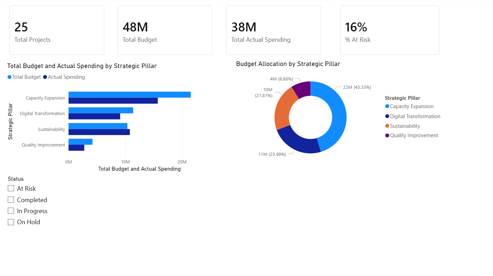
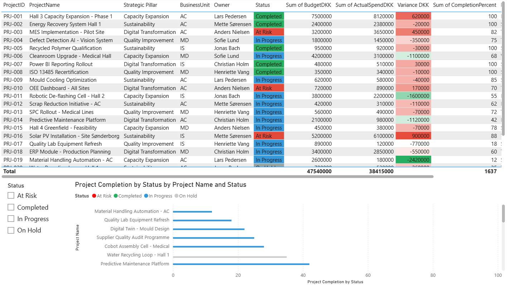
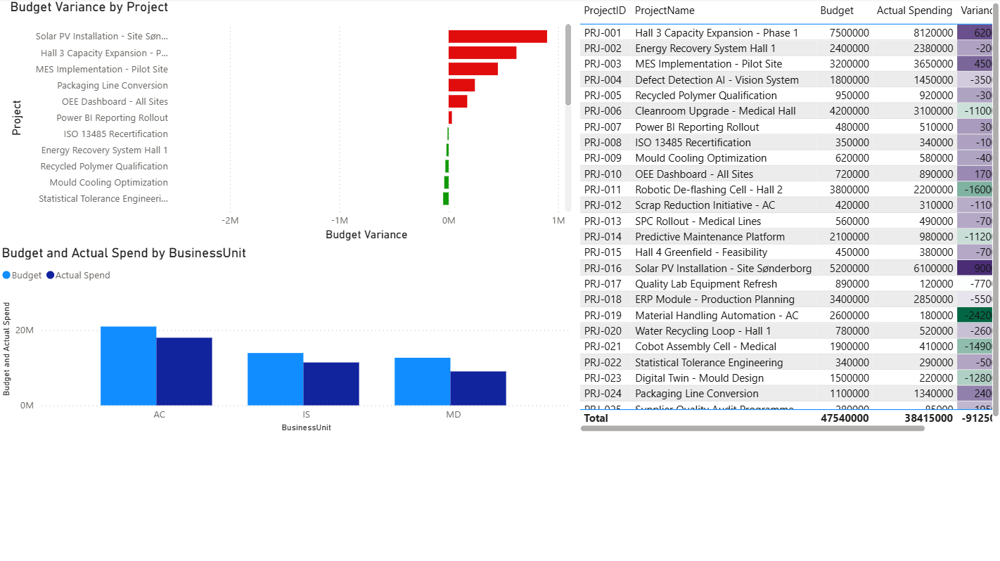
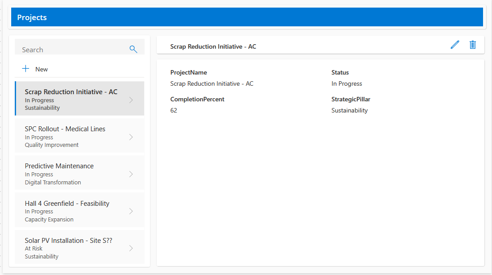

# Portfolio Dashboard of NPM

I made this Power BI dashboard over a weekend as an opportunity to explore how to use the application. Although the data I am using is fictional, the dashboard itself is real.

## The components within it

There are three pages that include information about 25 fictitious projects of a Danish manufacturer:

- **Page 1** — Overview of the portfolio with several key performance indicators (KPIs), allocation of budgets among the pillars of the organization and filterable status
- **Page 2** — Table of project level data which includes conditional formatting based upon the status and the variance of the budget
- **Page 3** — Financial View showing ranked variance of the budget and the comparison of budgets versus actual for each business unit

## The tools that were utilized

- Power Query was used for cleaning the data (dates had multiple formats, some trailing white space)
- DAX was used to create one measure (% At Risk) and one calculated column (Variance DKK)
- Conditional Formatting was applied in three ways including rules, gradient, and fx-based
- A two-table data model was created with a one-to-many relationship between projects and milestones

## Power Apps companion

A small Power App that connects to the same project data has also been built, it uses the same Excel workbook as the Power BI dashboard.

## Files

- `NPM_PortfolioManagement.pbix` — Open in Power BI Desktop
- `projects.csv`, `milestones.csv` — Source data
- `page1_overview.png`, `page2_health.png`, `page3_financial.png` — Power BI screenshots
- `powerapps.png` — Power App screenshot
